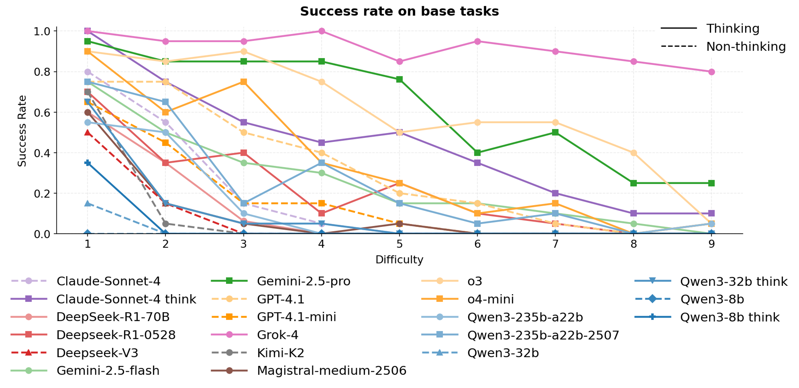

# ArtifactsBench: A Benchmark for Long-Horizon Planning and Structured Reasoning in Virtual Worlds

---
## Abstract
Large language models (LLMs) have shown remarkable capabilities in isolated step-by-step reasoning tasks such as mathematics and programming, but their proficiency in long-horizon planning, where solutions require extended, structured sequences of interdependent actions, remains underexplored. Existing benchmarks typically assess LLMs through abstract or low-dimensional algorithmic tasks, failing to capture the complexity of realistic planning environments. We introduce ArtifactsBench, a novel benchmark designed specifically to evaluate long-horizon planning and structured reasoning within complex RPG-inspired virtual worlds. ArtifactsBench provides a rigorously constructed dataset of tasks covering a wide range of difficulties, a simulated environment to execute and validate agent plans, and detailed analytical tools for evaluating model performance. Tasks challenge models to formulate strategic plans, efficiently gather resources, master necessary skills, craft equipment, and defeat adversaries, reflecting practical scenarios' layered dependencies and constraints. Our extensive evaluation of 20 state-of-the-art LLMs, including both open-source and proprietary models and agentic architectures, reveals significant performance disparities typically unseen in conventional reasoning benchmarks. Detailed error analysis further uncovers specific weaknesses in current models' abilities to generate robust high-level plans and reliably execute structured actions. ArtifactsBench thus not only significantly advances the evaluation of LLM reasoning but also provides a flexible, scalable foundation for future research into advanced, autonomous planning in virtual environments.

---
